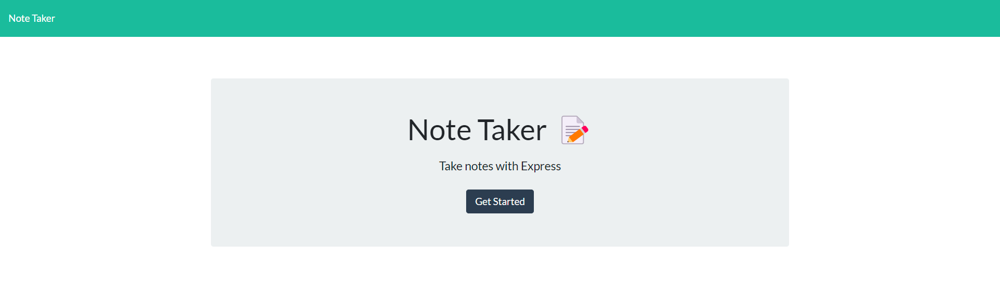
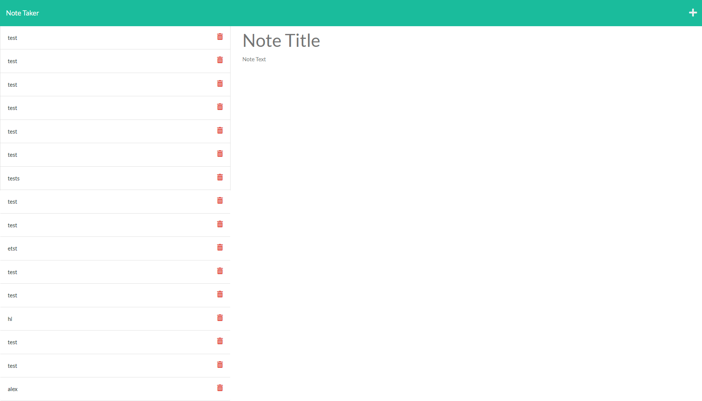

# Note Taker

## Description
This application is a note taker. It allows users to input a note title and related comments. The notes will then be saved using file system and data persistence.

## Installation

Run dependencies with npm i. Run localhost:3001 to run application.

## Usage

## Features

This application uses node.js and express.js to implement data persistence along with file system to keep track of inputs and apply them to a webpage.